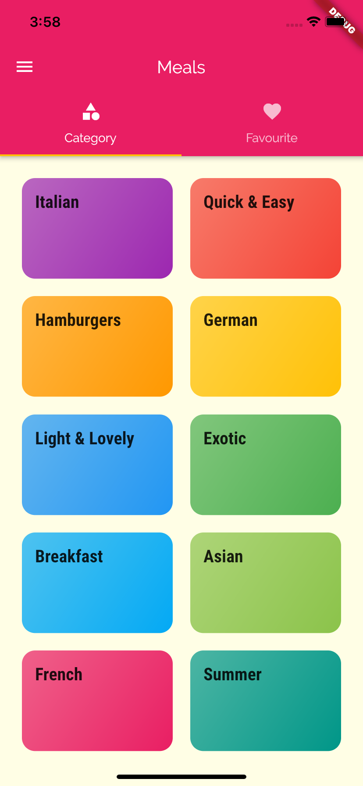

# Flutter-Projects-APPs
All my work is stored here while trying to learn FLUTTER DART. Hope this helps you also !

<h2> Recipe App </h2>
<p> While trying to learn Flutter Dart, this is my Recipe App, which I created to learn deep inside dart and to explore different Widgets in flutter !

<h2>Functionality</h2>
<li>Cross Platform App</li>
<li>Navigation Widget</li>
<li>Filter Buttons</li>
<li>Responsive</li>

<h2>Installations</h2>

```
Download the Code
```

<li>Run</li>

```
flutter run
```
<h2>ScreenShots & SnapShots</h2>

<h4><li>Home Screen</li></h4>



<h4>Hamburger Menu Option</h4>


<h4>Furthermore inside the Category Screen</h4>


<h4>Specific Dish Recipe Screen</h4>


